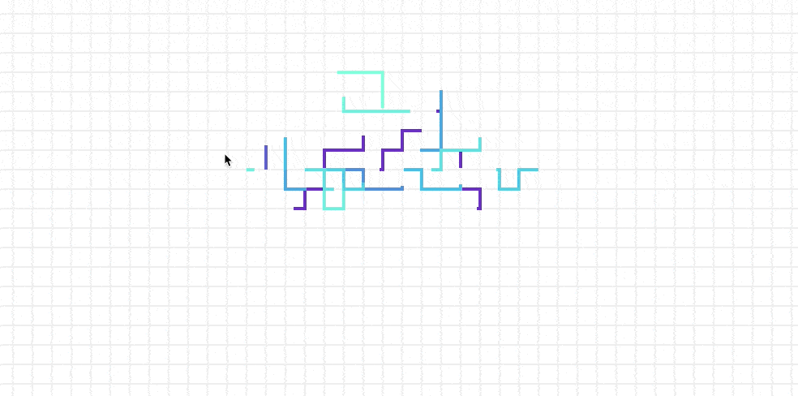

animated-grid-lines

[![NPM version][http://img.shields.io/npm/v/animated-grid-lines?style=for-the-badge&colorA=023e8a&colorB=00b4d8]][https://www.npmjs.com/package/animated-grid-lines]

A react component that renders an interactive grid that of lines that shout out from a user's cursor on hover.

Please give it a ⭐️ if you find it useful or interesting.



## Installation

```bash
npm install animated-grid-lines

# or

yarn add animated-grid-lines
```

## Usage

Import the `Grid` component into one of your React component files.

```tsx
import Grid from 'animated-grid-lines';
```

Use it!

```tsx
<Grid />
```

The grid will take the full width and height of its parent.

## Props

[See playground](https://robertcoopercode.github.io/animated-grid-lines) for available props.

## Playground

[This storybook playground](https://robertcoopercode.github.io/animated-grid-lines) is available to explore the component and try out different values for props.